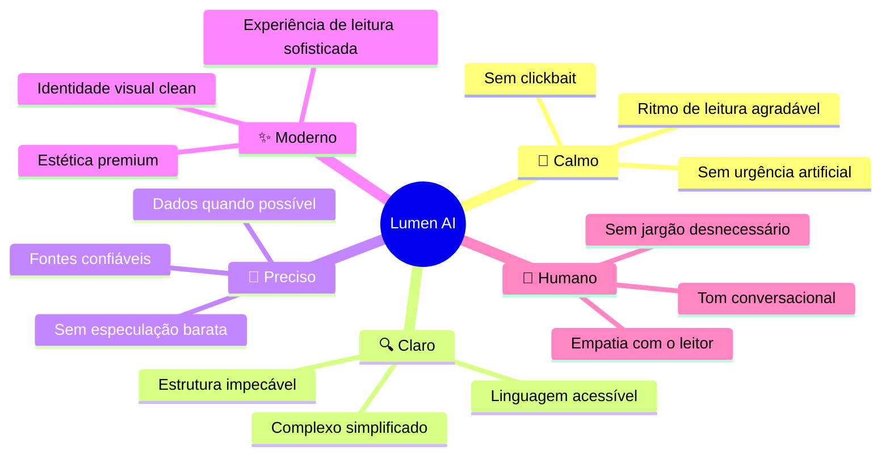
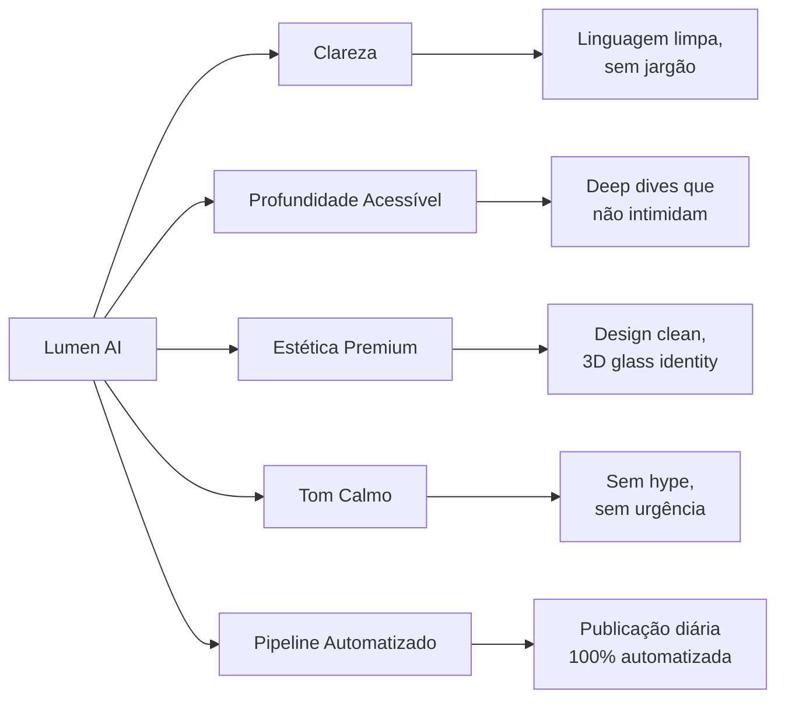

# 🧠 Brand Book — Análise Competitiva & Posicionamento de Marca

> Documento conceitual de posicionamento: análise de mercado, identidade, tom de voz e estratégia de diferenciação.

---

## 1. Análise Competitiva

### 1.1 Os 3 Principais Concorrentes

#### 🔴 The Verge AI

| Atributo | Detalhe |
|---|---|
| **URL** | [theverge.com/ai-artificial-intelligence](https://www.theverge.com/ai-artificial-intelligence) |
| **Público** | Entusiastas de tech, early adopters, audiência generalista |
| **Formato** | Artigos + podcast (*The Vergecast*) |
| **Tom** | Conversacional, crítico, cético, usa humor e ironia |
| **Frequência** | Dezenas de artigos por dia |
| **Conteúdo** | Notícias do dia, análises críticas, impacto social da IA |
| **Estilo Visual** | Editorial vibrante, cores fortes, tipografia bold |

**Forças:**
- Cobertura em tempo real com perspectiva editorial forte
- Tom único que questiona o hype — "jornalismo cético de IA"
- Enorme audiência estabelecida e autoridade de marca multi-décadas
- Multimídia (podcast + artigos + vídeo)

**Fraquezas:**
- Zero profundidade técnica — não ensina, apenas comenta
- Volume altíssimo de conteúdo gera superficialidade
- Não é "acionável" — leitor sai informado, mas não capacitado
- Design caótico e sobrecarregado de anúncios

---

#### 🟣 Towards Data Science (TDS)

| Atributo | Detalhe |
|---|---|
| **URL** | [towardsdatascience.com](https://towardsdatascience.com) |
| **Público** | Data scientists, ML engineers, acadêmicos, profissionais técnicos |
| **Formato** | Artigos longos (1.000-2.500+ palavras), tutoriais, deep dives |
| **Tom** | Acadêmico, denso, instrutivo, sóbrio |
| **Frequência** | ~10-15 artigos/dia (comunidade de múltiplos autores) |
| **Conteúdo** | Papers, tutoriais de código, arquiteturas de ML, análises teóricas |
| **Estilo Visual** | Limpo mas austero, minimalista funcional, sem personalidade visual |

**Forças:**
- Profundidade técnica incomparável — a "bíblia" de data science
- Credibilidade acadêmica e profissional consolidada
- Artigos escritos por practitioners reais (1ª pessoa)
- Independente do Medium com plataforma própria

**Fraquezas:**
- Intimidador para não-técnicos — barreira de entrada altíssima
- Sem personalidade ou voz editorial unificada (artigos de 100+ autores)
- Design funcional mas sem identidade visual memorável
- Sem conteúdo sobre impacto em negócios/vida prática

---

#### 🟡 The Neuron

| Atributo | Detalhe |
|---|---|
| **URL** | [theneurondaily.com](https://www.theneurondaily.com) |
| **Público** | Profissionais ocupados, 600K+ assinantes (Microsoft, Apple, Salesforce) |
| **Formato** | Newsletter diária de 3 min + podcast |
| **Tom** | Divertido, pop, casual, emojis pesados (😸😺🧠) |
| **Frequência** | Diária (5am PT / 8am ET) |
| **Conteúdo** | Curadoria de notícias IA em formato ultra-resumido, manchetes clickbait |
| **Estilo Visual** | Moderno, emojis como identidade, high-energy |

**Forças:**
- Formato perfeito para consumo rápido — 3 minutos/dia
- Crescimento explosivo (adquirida por plataforma de newsletters)
- Personalidade forte e reconhecível (emojis, humor pop)
- Distribuição via email = propriedade da audiência

**Fraquezas:**
- Superficial por natureza — curadoria sem profundidade
- Tom pode parecer infantil para profissionais seniores
- Dependência de clickbait no título
- Sem conteúdo perene (evergreen) — tudo é efêmero

---

### 1.2 Matriz de Posicionamento

```
                          PROFUNDIDADE
                              ▲
                              │
           TDS ●              │
           (acadêmico,        │
            ultra-técnico)    │
                              │
                              │        ★ NÓS
                              │        (acessível + profundo,
                              │         clean + calmo)
                              │
    ─────────────────────────┼────────────────────────── ▶ ACESSIBILIDADE
              │               │
              │               │
    The Verge ●               │         The Neuron ●
    (editorial cético,        │         (curadoria rápida,
     superficial)             │          divertida)
                              │
```

**O gap:** Nenhum concorrente ocupa o quadrante **acessível + profundo**. Existe um espaço claro entre o TDS (técnico demais) e o The Neuron (raso demais) para um blog que explica IA com clareza, calma e profundidade — sem intimidar nem trivializar.

---

## 2. Nome da Marca

### Proposta: **Lumen AI**

> *Lumen* — do latim: unidade de fluxo luminoso. Clareza. Iluminação. Entendimento.

#### Racional

| Critério | Avaliação |
|---|---|
| **Significado** | "Luz" — metáfora perfeita para clareza em assuntos complexos |
| **Sonoridade** | Suave, moderno, calmo — duas sílabas, fluido em PT e EN |
| **Memorabilidade** | Curto, distinto, fácil de digitar e lembrar |
| **Domínio** | Variações disponíveis: `lumen.ai`, `lumenai.blog`, `getlumen.ai` |
| **Visual** | Inspira identidades clean — luz, gradientes suaves, espaços brancos |
| **Conexão com IA** | Evoca a ideia de "iluminar" temas complexos de IA |
| **Tom** | Calmo, sofisticado, não agressivo — o oposto de "The Neuron" ou "TechCrunch" |

#### Alternativas consideradas

| Nome | Por que não |
|---|---|
| Synapse | Já saturado no ecossistema de IA (apps, startups) |
| Nexus AI | Genérico, evoca "ponto de conexão" sem clareza |
| Aether | Muito abstrato — não comunica o propósito |
| Epoch | Bom, mas "época" é temporal — não transmite a essência editorial |
| Clarity AI | Já existe como empresa de ESG analytics |
| Signal | Mensageiro e empresa já usam |

#### Tagline

> **"Lumen AI — Clareza no que importa."**

Alternativas:
- *"A luz na complexidade."*
- *"IA explicada com clareza."*
- *"Entenda IA. Sem ruído."*

---

## 3. Personalidade da Marca

### 3.1 Arquétipo

**O Sábio** (*The Sage*)

> O Sábio busca a verdade. Não grita, não sensacionaliza, não simplifica demais. Ele ilumina. Explica com paciência. Convida à reflexão em vez de criar urgência.

### 3.2 Atributos de Personalidade



### 3.3 A Marca É vs. A Marca Não É

| A Marca **É** | A Marca **NÃO É** |
|---|---|
| Calma e confiante | Ansiosa ou alarmista |
| Clara e acessível | Simplista ou superficial |
| Sofisticada e moderna | Fria ou corporativa |
| Profunda quando necessário | Acadêmica ou intimidadora |
| Opinativa com embasamento | Sensacionalista |
| Clean e respirável | Poluída de anúncios |
| Consistente no tom | Emojis excessivos ou humor forçado |

---

## 4. Tom de Voz

### 4.1 Princípios

| Princípio | Descrição | Exemplo |
|---|---|---|
| **Clareza acima de tudo** | Cada frase deve levar o leitor um passo adiante no entendimento | ❌ "O paradigma multimodal disruptou o ecossistema" ✅ "Modelos que entendem texto, imagem e áudio ao mesmo tempo estão mudando como usamos IA" |
| **Calma, não urgência** | Sem FOMO, sem alarme, sem "breaking" | ❌ "URGENTE: isto vai mudar TUDO!" ✅ "Um avanço que merece atenção — e uma explicação calma" |
| **Profundidade acessível** | Explorar a fundo sem perder o leitor | ❌ "O transformer usa attention heads com Q, K, V matrices" ✅ "O transformer funciona como um leitor que destaca o que importa em cada frase" |
| **Opinativo com base** | Ter ponto de vista, mas fundamentar | ❌ "ChatGPT é inútil" ✅ "O ChatGPT funciona bem para X, mas falha quando..." |
| **Humano e conversacional** | Falar como um mentor competente, não um paper | ❌ "A supracitada implementação evidencia..." ✅ "Na prática, isso significa que..." |

### 4.2 Escala de Tom por Contexto

| Contexto | Tom |
|---|---|
| **Notícias** | Direto, factual, com análise rápida |
| **Tutoriais** | Didático, passo a passo, encorajador |
| **Opinião** | Assertivo, reflexivo, convida ao debate |
| **Ferramentas** | Prático, comparativo, honesto nos prós/contras |
| **Tendências** | Prospectivo, embasado em dados, cauteloso com previsões |

### 4.3 Vocabulário da Marca

| ✅ Usar | ❌ Evitar |
|---|---|
| Na prática | Disruptivo |
| Vale entender que | URGENTE / BREAKING |
| A questão central é | Revolucionário |
| Isso importa porque | Game-changer |
| De forma clara | Paradigma |
| O que muda pra você | Singularidade chegou |

---

## 5. Posicionamento no Mercado

### 5.1 Declaração de Posicionamento

> **Para** profissionais curiosos que querem entender IA sem ruído,
> **Lumen AI** é o blog de tecnologia e inteligência artificial
> **que** transforma temas complexos em conhecimento claro e acessível,
> **diferente de** blogs hype-driven ou ultra-técnicos,
> **porque** acreditamos que clareza é o verdadeiro superpoder na era da IA.

### 5.2 Pilares de Diferenciação

| Pilar | O que significa |
|---|---|
| **Clareza** | Explicamos o complexo de forma limpa e estruturada |
| **Profundidade acessível** | Vamos a fundo sem perder quem não é técnico |
| **Estética premium** | Design clean, leitura agradável, zero noise |
| **Consistência** | Publicação diária automatizada com curadoria de qualidade |
| **Independência** | Sem viés corporativo, opinião fundamentada |

### 5.3 Mapa Perceptual

| Dimensão | The Verge | TDS | The Neuron | **Lumen AI** |
|---|---|---|---|---|
| Profundidade | ⭐⭐ | ⭐⭐⭐⭐⭐ | ⭐ | ⭐⭐⭐⭐ |
| Acessibilidade | ⭐⭐⭐ | ⭐ | ⭐⭐⭐⭐⭐ | ⭐⭐⭐⭐ |
| Frequência | ⭐⭐⭐⭐⭐ | ⭐⭐⭐⭐ | ⭐⭐⭐⭐⭐ | ⭐⭐⭐ |
| Estética | ⭐⭐ | ⭐⭐ | ⭐⭐⭐ | ⭐⭐⭐⭐⭐ |
| Tom calmo/premium | ⭐⭐ | ⭐⭐⭐ | ⭐ | ⭐⭐⭐⭐⭐ |
| Actionable | ⭐ | ⭐⭐⭐⭐ | ⭐⭐ | ⭐⭐⭐⭐ |
| Personalidade | ⭐⭐⭐⭐ | ⭐ | ⭐⭐⭐⭐⭐ | ⭐⭐⭐⭐ |

---

## 6. Diretrizes Editoriais

### 6.1 Estrutura Padrão de Artigo

```
1. Título — claro, SEO-friendly, sem clickbait (max 60 chars)
2. Excerpt — uma frase que resume o "por que ler" (max 160 chars)
3. Imagem de capa — estilo 3D glass minimalista da marca
4. Introdução — contextualiza o tema em 2-3 parágrafos
5. Corpo — H2/H3 estruturados, listas, exemplos práticos
6. Implicação — "o que isso muda pra você"
7. Conclusão — síntese + reflexão, sem CTA genérico
```

### 6.2 Regras de Ouro

1. **Nunca publicar sem um "so what?"** — todo artigo deve responder "por que isso importa?"
2. **Mínimo 600 palavras** — respeitar a profundidade prometida
3. **Uma categoria por artigo** — classificação clara e consistente
4. **Imagem sempre original** — DALL-E 3 no estilo da marca, nunca stock
5. **Score SEO ≥ 6** — filtro mínimo de qualidade para publicação

### 6.3 Tom em Ação — Exemplos Comparativos

**Título genérico:**
> ❌ "OpenAI Just Dropped GPT-5 and It's INSANE!!!"

**Título Lumen AI:**
> ✅ "GPT-5 Is Here: What Actually Changed (and What Didn't)"

---

**Intro genérica:**
> ❌ "Another day, another AI bombshell! OpenAI just dropped GPT-5 and the internet is going crazy..."

**Intro Lumen AI:**
> ✅ "OpenAI announced GPT-5 this week — and beyond the hype, there are three upgrades that genuinely change how we'll work with AI. Let's break them down."

---

## 7. Resumo Executivo



| Atributo | Definição |
|---|---|
| **Nome** | Lumen AI |
| **Tagline** | "Clareza no que importa." |
| **Arquétipo** | O Sábio |
| **Tom** | Calmo, claro, conversacional, profundo |
| **Público** | Profissionais curiosos sobre o impacto da IA |
| **Diferencial** | Profundidade acessível + estética premium + pipeline automatizado |
| **Categorias** | Notícias IA, Ferramentas IA, Tutoriais, Tendências, Opinião |
| **Paleta** | Preto, azul, ciano (estabelecida) |
| **Imagens** | Objetos 3D glass — minimalistas, centrados, background escuro |
