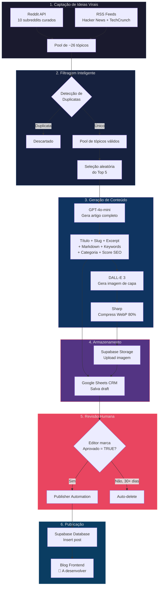

# 📘 Blog AI — Product Guide & Business Plan

> Guia completo do produto: visão de negócio, PRD, módulos técnicos e workflow operacional.

---

## 1. Visão do Negócio

### 1.1 Nicho & Segmento

| Atributo | Detalhe |
|---|---|
| **Nicho Principal** | Inteligência Artificial & Tecnologia |
| **Segmento** | Blog de conteúdo educacional e informativo |
| **Idioma do Conteúdo** | Inglês (gerado pela IA) |
| **Modelo de Negócio** | Tráfego orgânico via SEO → monetização futura (ads, afiliados, produtos digitais) |
| **Diferencial Competitivo** | Pipeline 100% automatizado — da captação de tendências à publicação |

### 1.2 Público-Alvo

> *"Curious professionals who want to understand AI's impact on their lives, careers, and businesses."*
> — Extraído do System Prompt

- Profissionais de tecnologia e negócios
- Entusiastas de IA que buscam entender impactos práticos
- Empreendedores explorando oportunidades com IA
- Desenvolvedores e designers interessados em ferramentas de IA

### 1.3 Categorias Editoriais

As categorias são geridas dinamicamente via Google Sheets (aba `Dashboard`, célula `B1`). Configuração padrão:

| Categoria | Descrição |
|---|---|
| **Notícias IA** | Breaking news e anúncios do ecossistema de IA |
| **Ferramentas IA** | Reviews e análises de ferramentas e plataformas |
| **Tutoriais** | Guias práticos e how-to sobre tecnologias de IA |
| **Tendências** | Análises de mercado e previsões sobre o futuro da IA |
| **Opinião** | Artigos opinativos e análises críticas |

### 1.4 Tom de Voz & Estilo Editorial

Definido dinamicamente na célula `B2` da aba `Dashboard`:

> *"Você é um escritor sênior de um blog sobre Inteligência Artificial. Escreva de forma cativante, acessível e otimizada para SEO. O tom deve ser informativo mas envolvente, como se estivesse explicando para um amigo curioso."*

**Características:**
- Informativo mas acessível (não excessivamente técnico)
- Tom conversacional ("explicando para um amigo curioso")
- Otimizado para SEO
- Conteúdo expandido com insights e exemplos — não mero resumo
- Posts com mínimo de 600 palavras

---

## 2. PRD — Blog Platform

### 2.1 Objetivo

Uma plataforma de blog que publica artigos sobre IA e tecnologia, alimentada por um pipeline de automação. O conteúdo é armazenado e servido via Supabase.

### 2.2 Componentes

| Componente | Status | Descrição |
|---|---|---|
| **Supabase Database** | ✅ Ativo | Tabela `posts` com campos: `title`, `slug`, `excerpt`, `content`, `image_url`, `tags`, `published_at` |
| **Supabase Storage** | ✅ Ativo | Bucket `blog-images` com pasta `covers/` para imagens de capa |
| **Frontend** | 🔲 A definir | Blog front-end ainda não implementado |
| **CMS (Google Sheets)** | ✅ Ativo | Gestão editorial via planilha com abas Dashboard e Rascunhos |

### 2.3 Schema do Banco de Dados (Supabase)

```
posts
├── title          (text)
├── slug           (text, unique)
├── excerpt        (text)
├── content        (text, markdown)
├── image_url      (text)
├── tags           (text)
└── published_at   (timestamptz)
```

### 2.4 Fluxo Editorial (Google Sheets CRM)

**Aba `Rascunhos`** — Colunas:

| Coluna | Tipo | Descrição |
|---|---|---|
| Assunto | text | Resumo curto do título (30 chars) |
| Título do Artigo | text | Título completo SEO-friendly |
| Categoria | text | Classificação editorial |
| Data | date | Data de criação (YYYY-MM-DD) |
| Conteúdo | text | Markdown completo com frontmatter |
| Imagem | url | URL pública da imagem no Supabase |
| Score SEO | number | Pontuação de relevância (1-10) |
| Aprovado | boolean | Checkbox de aprovação humana |
| Publicado | boolean | Marca de publicação efetiva |

---

## 3. PRD — Automations Engine

### 3.1 Objetivo

Motor de automação que opera diariamente sem intervenção humana, executando o ciclo completo: captação de tendências → geração de artigos → geração de imagens → salvamento no CRM.

### 3.2 Tech Stack

| Tecnologia | Uso |
|---|---|
| **TypeScript** | Linguagem principal |
| **Node.js 20** | Runtime |
| **OpenAI GPT-4o-mini** | Geração de texto (artigos, metadados, SEO) |
| **DALL-E 3** | Geração de imagens de capa |
| **Sharp** | Compressão de imagens (WebP, 1200px, 80% quality) |
| **Reddit API** | Captação de trending topics (10 subreddits) |
| **RSS Parser** | Captação de notícias (Hacker News, TechCrunch) |
| **Google Sheets API** | CRM editorial e configurações dinâmicas |
| **Supabase** | Banco de dados + Object Storage |
| **GitHub Actions** | CI/CD e scheduling de execução |

### 3.3 Requisitos Funcionais

| ID | Requisito | Status |
|---|---|---|
| RF-01 | Captar trending topics de subreddits curados de IA | ✅ |
| RF-02 | Captar trending topics de feeds RSS de tech | ✅ |
| RF-03 | Detectar e filtrar tópicos duplicados por keyword overlap | ✅ |
| RF-04 | Gerar artigo completo com título, slug, excerpt, keywords, markdown | ✅ |
| RF-05 | Classificar artigo em uma das categorias editoriais | ✅ |
| RF-06 | Atribuir score de relevância SEO calibrado (1-10) | ✅ |
| RF-07 | Gerar imagem de capa via DALL-E 3 com estilo visual consistente | ✅ |
| RF-08 | Comprimir imagem para WebP otimizado | ✅ |
| RF-09 | Upload de imagem para Supabase Storage | ✅ |
| RF-10 | Salvar draft no Google Sheets CRM | ✅ |
| RF-11 | Publicar drafts aprovados para Supabase Database | ✅ |
| RF-12 | Auto-deletar drafts não aprovados após 30 dias | ✅ |
| RF-13 | Executar geração diária automatizada via GitHub Actions | ✅ |
| RF-14 | Executar publicação diária automatizada via GitHub Actions | ✅ |

---

## 4. Módulos do Sistema

### 4.1 `fetcher.ts` — Captação de Conteúdo Viral

**Responsabilidade:** Agregar trending topics de fontes curadas de IA/Tech.

**Fontes de dados:**

| Tipo | Fonte | Qtd por fonte |
|---|---|---|
| Reddit | `r/artificial`, `r/MachineLearning`, `r/ChatGPT`, `r/LocalLLaMA`, `r/singularity`, `r/StableDiffusion`, `r/OpenAI`, `r/technology`, `r/programming`, `r/webdev` | 2 posts/sub |
| RSS | Hacker News (filtrado AI/LLM/GPT), TechCrunch AI | 3 posts/feed |

**Comportamento:**
- Busca posts do Reddit por período `top/week`
- Silenciosamente ignora fontes que falharem (404, rate limit)
- Ordena resultado final por score de engajamento (mais viral primeiro)
- Retorna ~26 tópicos por execução

---

### 4.2 `generator.ts` — Geração de Conteúdo

**Responsabilidade:** Transformar trending topics em artigos originais e gerar imagens de capa.

#### Geração de Texto

| Parâmetro | Valor |
|---|---|
| Modelo | `gpt-4o-mini` |
| Temperature | `0.7` |
| Max Tokens | `2500` |
| Output | JSON com `title`, `slug`, `excerpt`, `contentMarkdown`, `seoKeywords`, `category`, `imageType`, `imagePrompt`, `relevanceScore` |

**Rubrica de Score SEO (1-10):**
- **1-3:** Memes, humor nichado, histórias pessoais
- **4-5:** Tópicos interessantes mas estreitos ou saturados
- **6-7:** Trending topics sólidos com engajamento comprovado
- **8-9:** Breaking news de alto impacto (ex: novo modelo do Google)
- **10:** Mudanças de paradigma (ex: AGI alcançada)

#### Geração de Imagem

| Parâmetro | Valor |
|---|---|
| Modelo | DALL-E 3 |
| Tamanho | 1024×1024 |
| Qualidade | standard |
| Estilo Visual | Objeto 3D único, material de vidro azul translúcido, gradiente azul→ciano, bordas com brilho, background escuro com vinheta, iluminação de estúdio |

**Pós-processamento (Sharp):**
- Resize: max 1200px largura
- Formato: WebP
- Qualidade: 80%

---

### 4.3 `sheets.ts` — CRM & Configurações

**Responsabilidade:** Interface com Google Sheets para gestão editorial e configurações dinâmicas.

**Abas gerenciadas:**

| Aba | Função |
|---|---|
| `Dashboard` | Configurações dinâmicas (categorias, system prompt, image style) |
| `Rascunhos` | CRM de artigos gerados |

**Auto-criação:** Se as abas não existirem, o sistema as cria automaticamente com valores padrão.

---

### 4.4 `publisher.ts` — Publicação Automatizada

**Responsabilidade:** Transferir artigos aprovados do Google Sheets para o Supabase.

**Lógica:**
1. Percorre todas as linhas da aba `Rascunhos` (de baixo para cima)
2. **Auto-delete:** Remove drafts com +30 dias não publicados
3. **Publish:** Artigos com `Aprovado=TRUE` e `Publicado=FALSE` são inseridos no Supabase
4. O conteúdo markdown com frontmatter é parseado para extrair `slug`, `excerpt`, e `keywords`
5. Atualiza a flag `Publicado` para `TRUE` após sucesso

---

### 4.5 `supabase.ts` — Storage & Database Client

**Responsabilidade:** Cliente Supabase para upload de imagens e operações no banco.

**Operações:**
- Upload de imagens para bucket `blog-images/covers/`
- Suporta formatos WebP e PNG
- Retorna URL pública após upload
- Upsert habilitado (sobrescreve duplicatas)

---

### 4.6 `index.ts` — Orquestrador Principal

**Responsabilidade:** Pipeline principal que coordena todo o ciclo de geração.

**Fluxo de execução:**
1. Busca configurações do Dashboard
2. Capta conteúdo viral de todas as fontes
3. Carrega títulos existentes para detecção de duplicatas
4. Filtra duplicatas por overlap de keywords (≥2 keywords = duplicata)
5. Seleciona aleatoriamente um tópico entre os top 5 únicos
6. Gera artigo via GPT-4o-mini
7. Gera imagem via DALL-E 3
8. Comprime imagem via Sharp
9. Faz upload da imagem para Supabase Storage
10. Salva draft completo no Google Sheets CRM

---

## 5. Workflow End-to-End



---

## 6. CI/CD & Scheduling

O sistema roda automaticamente via **GitHub Actions** sem necessidade de servidor.

| Workflow | Schedule (UTC) | Schedule (BRT) | Script |
|---|---|---|---|
| **Daily Content Generator** | `0 12 * * *` | 09:00 diário | `npm run start` |
| **Daily Publisher** | `0 18 * * *` | 15:00 diário | `npm run publish` |

**Ambiente:** Ubuntu Latest, Node.js 20

**Secrets necessários:**
- `OPENAI_API_KEY`
- `GOOGLE_SERVICE_ACCOUNT_EMAIL`
- `GOOGLE_PRIVATE_KEY`
- `GOOGLE_SHEET_ID`
- `SUPABASE_URL`
- `SUPABASE_SERVICE_ROLE_KEY`

---

## 7. Identidade Visual Atual

| Elemento | Especificação |
|---|---|
| **Paleta dominante** | Preto + Azul + Ciano |
| **Estilo de imagens** | Objetos 3D minimalistas em vidro azul translúcido |
| **Background** | Escuro com vinheta suave |
| **Iluminação** | Estilo estúdio com glow nas bordas |

---

## 8. Próximos Passos — Análise Competitiva & Branding

> [!IMPORTANT]
> Os itens abaixo são os próximos passos já alinhados com o usuário para completar o posicionamento da marca.

### 8.1 Análise Competitiva
- [ ] Identificar os 3 principais blogs concorrentes no nicho de IA
- [ ] Analisar: conteúdo, SEO, frequência, tom de voz, design, redes sociais
- [ ] Mapear pontos fortes e fracos de cada concorrente
- [ ] Identificar lacunas e oportunidades de diferenciação

### 8.2 Identidade de Marca
- [ ] Definir nome do blog
- [ ] Proposta de valor única
- [ ] Tom de voz e personalidade da marca
- [ ] Identidade visual (logo, paleta de cores, tipografia)
- [ ] Guidelines de estilo editorial

### 8.3 Blog Frontend
- [ ] Definir stack tecnológico
- [ ] Design do layout e UX
- [ ] Desenvolvimento e deploy
